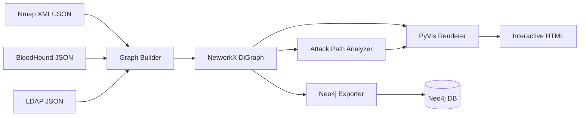

# Attack Path Visualizer (APV)
> **Fuse recon data. Map privilege escalation paths. Visualize the attack surface.**
**Attack Path Visualizer** is a modular Python CLI that ingests security reconnaissance outputs — **Nmap**, **BloodHound**, and **LDAP** exports — fuses them into a unified directed graph, identifies privilege escalation vectors, and renders an interactive HTML attack-path map.
Built for red teamers, penetration testers, and security engineers who need a single pane of glass across network and Active Directory enumeration data.
---
## Features
| Capability | Description |
|---|---|
| **Multi-source ingestion** | Parse Nmap XML/JSON, BloodHound JSON, and custom LDAP dumps in one run |
| **Intelligent node fusion** | Merge hosts by IP, FQDN, and short hostname (e.g. `192.168.1.10` ↔ `DC01.corp.local`) |
| **PrivEsc analysis** | Shortest paths to Domain Admins / HVTs, Kerberoast + AdminTo, unconstrained delegation, sensitive ports |
| **Interactive HTML graph** | PyVis canvas with physics, search bar, tooltips, and risk-based color coding |
| **Neo4j export** | Generate Cypher scripts or ingest directly into a Neo4j instance |
| **Modular architecture** | Clean separation of parsers, graph engine, analyzer, and renderers |
---
## How It Works

---
## Requirements
- **Python 3.10+**
- Dependencies listed in `requirements.txt`:
  - [NetworkX](https://networkx.org/) — graph engine
  - [PyVis](https://pyvis.readthedocs.io/) — interactive visualization
  - [Neo4j Python Driver](https://neo4j.com/docs/python-manual/current/) — optional database export
---
## Installation
```bash
git clone https://github.com/YOUR_USERNAME/Visualizzer.git
cd Visualizzer
pip install -r requirements.txt
```
---
## Quick Start
### 1. Generate demo data
```bash
python generate_mock_data.py --output mock_data
```
This creates realistic sample files under `mock_data/`:
```
mock_data/
├── nmap_scan.xml
├── ldap_export.json
└── bloodhound/
    ├── users.json
    ├── computers.json
    ├── groups.json
    └── domains.json
```
### 2. Run APV
```bash
python main.py \
  --nmap mock_data/nmap_scan.xml \
  --bloodhound mock_data/bloodhound \
  --ldap mock_data/ldap_export.json \
  -o output/attack_path_graph.html \
  --analysis-report output/analysis.json
```
### 3. Open the graph
Open `output/attack_path_graph.html` in any modern browser.
---
## Usage
### Basic scan fusion
```bash
python main.py \
  --nmap scans/internal.xml \
  --bloodhound bloodhound_export/ \
  -o reports/attack_graph.html
```
### Full pipeline with all sources
```bash
python main.py \
  --nmap scans/nmap.xml \
  --bloodhound bloodhound/ \
  --ldap ldap_dump.json \
  -o output/graph.html \
  --analysis-report output/analysis.json \
  --log-level INFO
```
### Multiple Nmap files
```bash
python main.py \
  --nmap scan1.xml \
  --nmap scan2.xml \
  --bloodhound bloodhound/ \
  -o output/combined.html
```
### Export to Neo4j (Cypher script)
```bash
python main.py \
  --nmap mock_data/nmap_scan.xml \
  --bloodhound mock_data/bloodhound \
  --neo4j-cypher output/graph.cypher
```
### Direct Neo4j ingestion
```bash
python main.py \
  --nmap mock_data/nmap_scan.xml \
  --bloodhound mock_data/bloodhound \
  --neo4j-ingest \
  --neo4j-uri bolt://localhost:7687 \
  --neo4j-user neo4j \
  --neo4j-password your_password
```
---
## Supported Input Formats
### Nmap
| Format | Flag | Extracts |
|---|---|---|
| XML (`.xml`) | `--nmap` | Hosts, open ports, OS fingerprint, services |
| JSON (`.json`) | `--nmap` | Same fields from JSON scan output |
### BloodHound
| Files | Flag | Extracts |
|---|---|---|
| `users.json`, `computers.json`, `groups.json`, `domains.json` | `--bloodhound` | AD objects, ACLs, sessions, trust relationships |
**Supported edge types:** `AdminTo`, `MemberOf`, `HasSession`, `GenericAll`, `WriteDacl`, `WriteOwner`, `GenericWrite`, `ForceChangePassword`, `AllowedToDelegate`, and more.
### LDAP
| Format | Flag | Extracts |
|---|---|---|
| Custom JSON export (`.json`) | `--ldap` | Users, computers, groups, SPNs, delegation flags, group memberships |
---
## Analysis Engine
APV automatically detects:
| Vector | What it finds |
|---|---|
| **Shortest PrivEsc paths** | Routes from low-privileged users to Domain Admins / HVTs |
| **Kerberoast + AdminTo** | Kerberoastable service accounts with local admin rights |
| **Unconstrained delegation** | Computers with unconstrained delegation and active user sessions |
| **Sensitive port exposure** | Ports 3389, 445, 5985, etc. on hosts where a user has admin rights |
Results are printed to the console and optionally saved as JSON via `--analysis-report`.
---
## Visualization Legend
The interactive HTML graph uses risk-based styling:
| Color | Node Type |
|---|---|
| 🔴 `#FF4D4D` | High Value Targets (Domain Admins, Enterprise Admins) |
| 🟠 `#FF9933` | Kerberoastable users |
| 🟢 `#4DFF88` | Standard users |
| 🔵 `#4D94FF` | Computers / network devices |
| 🟣 `#B366FF` | Groups |
| 🟡 `#FFD94D` | Domains |
